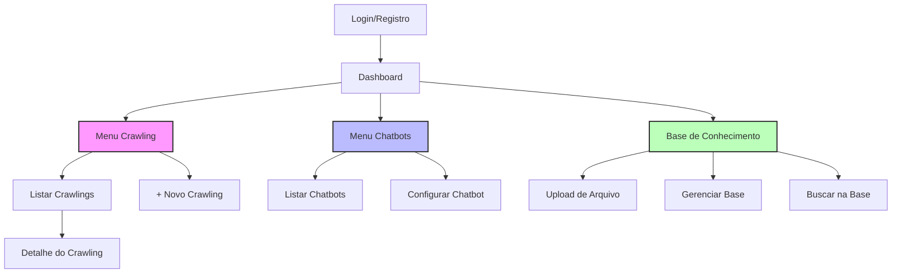

# Estrutura do Site GWAN Admin

Este documento apresenta uma visão geral das principais rotas, menus e funcionalidades do painel administrativo GWAN.

## Visão Geral do Fluxo



## Menus Principais

- **Dashboard:** Visão geral do sistema após login.
- **Crawling:** Gerenciamento de requisições de crawling de dados.
- **Chatbots:** Gerenciamento e configuração de chatbots.
- **Base de Conhecimento:** Upload, busca e gerenciamento de arquivos e datasets.
- **Perfil do Usuário:** Gerenciamento de dados do usuário logado.

## Funcionalidades por Módulo

### Crawling
- Listagem de crawlings realizados
- Criação de novo crawling (modal)
- Visualização de detalhes e resultado do crawling
- Paginação e tratamento de estados (loading, erro, vazio)

### Chatbots
- Listagem de chatbots cadastrados
- Criação e configuração de chatbots
- Status e integrações (ex: N8N)

### Base de Conhecimento
- Upload de arquivos PDF
- Gerenciamento de datasets
- Busca textual na base
- Visualização de status de processamento

### Autenticação
- Registro de novo usuário
- Login com verificação por código
- Proteção de rotas e redirecionamento

## Estrutura de Pastas (resumida)

```
src/
  pages/         # Páginas principais do site
  components/    # Componentes reutilizáveis e módulos
  hooks/         # Hooks customizados
  services/      # Serviços de integração com API
  types/         # Tipos TypeScript
  assets/        # Arquivos estáticos
```

## Observações
- O projeto utiliza React, Vite, TypeScript, Tailwind CSS, TanStack Query, React Hook Form, Zod, Headless UI, Heroicons, i18next.
- O código é modularizado por domínio (crawling, chatbots, conhecimento, auth).
- O sistema é responsivo e acessível.

---

Para detalhes de cada módulo, consulte os arquivos markdown específicos ou o README principal. 